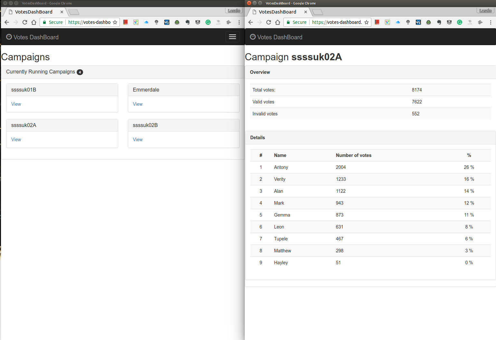

# VOTES DASHBOARD

* A rails application displays the results of a TV SMS voting campaign.
* A command line tool to import and pre process a logfile.

### Description of my approach
**and design decisions**

1. Create the command line script that imports the log file into the database **dataParser**  

  - **my approach here is:**
    - Because the task specified it as a comand line script, this functionality is not part of the rails app, so this has to be run separately.
    - the script can be run by executing the `ruby parsevotes.rb` with the text file as an argument.
    - the `parsevotes.rb` works as a delegator, if there was an argument it invokes the `parse.rb` with the path of the argument passed in the constructor of `Parse.new()`
    - So I create a ruby class of `Parse` that does a basic check on the file discarding the non-well-formatted lines and parses the rest according to the parsing rules and pushes them in the database.
    - It has a basic logging functionality so the user can check if the process was successful and how many lines were imported and how many discarded.    

  - **the parsing process:**
    - Open the file, and push it line by line into a 'data' array to hold the data. I'm using an array of arrays because the order of the elements matters.
    - Parse the array items according to the specs and checks if a line is valid.
    - Strip the white space, non-utf-8 chars, empty lines
    - Check the data row length and the presence of the correct headers.
    - Split the value from the keys(headers) at ':' and pushes into an array prepared for database.

  - **push the parsed data into a database**:
    - postgres database, with data_mapper ORM. The coice is because I wanted something completely separate, standalone from the rails app as this script works and should work without the rails app.
    - the prepared data from `data_to_db` array goes into the db. New database entries being created in a "votes" table. All rows has 9 columns. All data goes in as "string".

2. Create a rails app **votesDashBoard**

  - **General**
    - The app is for displaying purposes only, So making it a read only app to basically only for visualizing the data stored in the database.
 In the parser the main item was a 'vote' in the rails app I decided to make the main resource a 'campaign'.
 - **Model:**
    - campaing(s) model, connected to the existing postgres database using Active Records.
  - **Views:**
    - The main landing page with the list of the campaigns (that has data).
    - Detailed campaign page where an overview and the detailed results can be seen.
      - Displayed data:
        - Overview: All votes, All Valid vote, All invalid votes in the campaign.
        - Details section: Table of the choices, number of votes for each choise along with a percentage and all this sorted in descending order of the casted votes. (Winner is on top of table).
    - used bootstrap for styling, responsive, mobile first.


### Usage

#### General setup
```
Ruby version: 2.3.0
Postgres account.
clone repo
cd votesDashBoard/votesDashBoard
bundle install
cd votesDashBoard/dataParser
bundle install
  create database votesDashBoard_development, votesDashBoard_test
  rake auto_migrate (for DataMapper)
  (rake db:migrate (for Active Records))  
rspec (in each folder)

```
#### Command line tool usage
```
ruby parsevotes.rb <path_to_space_sepatated_txt_file_to_parse>
e.g.: ruby parsevotes.rb votes.txt
```

**Try it online:** `https://votes-dashboard.herokuapp.com/` [click here](https://votes-dashboard.herokuapp.com/)

#### Things to improve in the future
- dataParser
  - more robust file handling (so the file can be csv, or tab separated not just space separated)
  - inline line detection from 'VOTE'-signal.
  - refactor the validation process from parse into it's own class.
- votesDashBoard
  - refactor the database queries to it's own class in the model layer.
  - improved styling (charts, more visual content)

#### User Stories

```
As a developer
So I can parse a logfile from an SMS campaign
I want to be able to run a parser command line tool.
```

```
As a manager
So I can see the result of a SMS campaign
I want to be able to see the results on a web page in a nicely formatted way.

```
### Screenshots from the app

